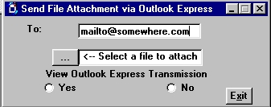



## SendAttachmentWithOutlookExpress

### Description

Attaches a file to send with Outlet Express
 
### More Info
 
Email Address and File to Attach

Program uses MSMAPI32.OCX

             |
---                |---
**Submitted On**   |2003-02-28 09:20:42
**By**             |[John Cunningham](https://github.com/Planet-Source-Code/PSCIndex/blob/master/ByAuthor/john-cunningham.md)
**Level**          |Advanced
**User Rating**    |4.7 (33 globes from 7 users)
**Compatibility**  |VB 5\.0, VB 6\.0
**Category**       |[Complete Applications](https://github.com/Planet-Source-Code/PSCIndex/blob/master/ByCategory/complete-applications__1-27.md)
**World**          |[Visual Basic](https://github.com/Planet-Source-Code/PSCIndex/blob/master/ByWorld/visual-basic.md)
**Archive File**   |[SendAttach1551862282003\.zip](https://github.com/Planet-Source-Code/john-cunningham-sendattachmentwithoutlookexpress__1-43623/archive/master.zip)

